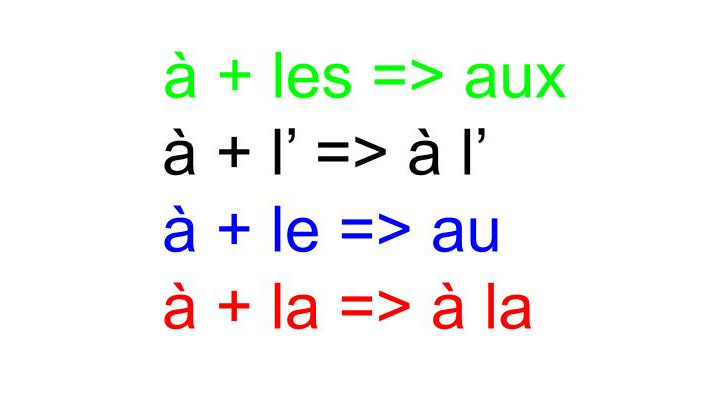

##### Comment utiliser correctement les articles contractés avec la préposition "à" ?

**Ce n'est pas compliqué mais il faut surtout connaître [les noms des parties du corps](https://paysdufle.fr/vocabulaire/corps-et-sante/parties-du-corps/index.html) et [leur genre](https://paysdufle.fr/grammaire/genre/les-parties-du-corps/index.html)**

Vous êtes prêts ? Vous avez bien révisé ? ;) Vous allez sans doute bien comprendre la formule ci-dessous.

Allez, entraînez-vous ! 

Avant de choisir votre réponse, essayez de vous poser les questions suivantes :

1. La partie du corps est-elle au pluriel (elle se termine par les lettres "s" ou "x") ? => aux (attention aux mots "dos" et "bras" !)
2. La partie du corps est-elle au singulier mais elle commence par une voyelle (a,e,i,o,u) ou par un "h" muet ? => à l'
3. La partie du corps est-elle au singulier, elle est de genre masculin et elle ne commence pas par une voyelle ou par un "h" muet ? => au
4. La partie du corps est-elle au singulier, elle est de genre féminin et elle ne commence pas par une voyelle ou par un "h" muet ? => à la 

Dans l'exercice n°1, on va vérifier si vous savez quand mettre l'article contracté "au" ou "aux" devant les mots "dos" et "bras". Regardez bien la photo, cela va vous aider :) 

Dans l'exercice n°2, il y a un vocabulaire assez facile. Si vous connaissez bien le corps humain, faites l'exercice n°3.

Chers Enseignants, cliquez [ici](https://paysdufle.fr/fle-ludique/activites-ludiques-par-theme/articles-contractes/index.html) pour voir une proposition d'activité ludique en rapport avec ce sujet.   