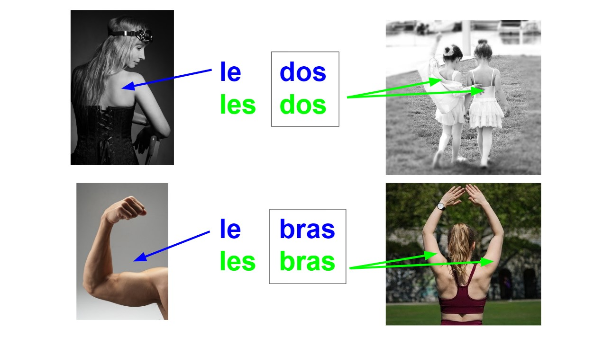

##### Comment mémoriser le genre des parties du corps ?

**Et si on utilisait des couleurs ?**

Le rouge - pour le genre féminin.

Le bleu - pour le genre masculin.

Observez bien les mots et leur couleur :

Pour mettre au pluriel tous ces mots, il faut ajouter le "s" à la fin sauf pour les mots "bras" et "dos".

Pourquoi ? Parce que ces mots ont déjà le "s" au singulier ! Leur forme ne change donc pas au pluriel. Regardez la photo ci-dessous !

Essayez maintenant d'associer les parties du corps aux articles définis (LE, LA, L', LES) qui conviennent.

Attention aux mots qui commencent par une voyelle (a, e, i, o, u) => exercice n° 1

Attention aux marques du pluriel (s, x) => exercice n° 2