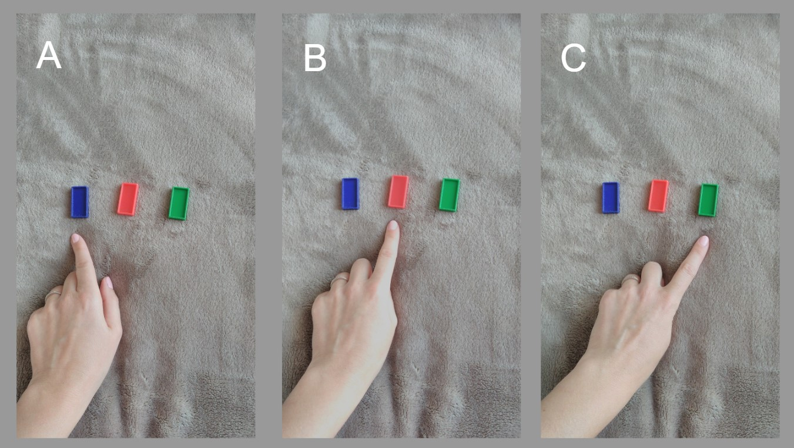
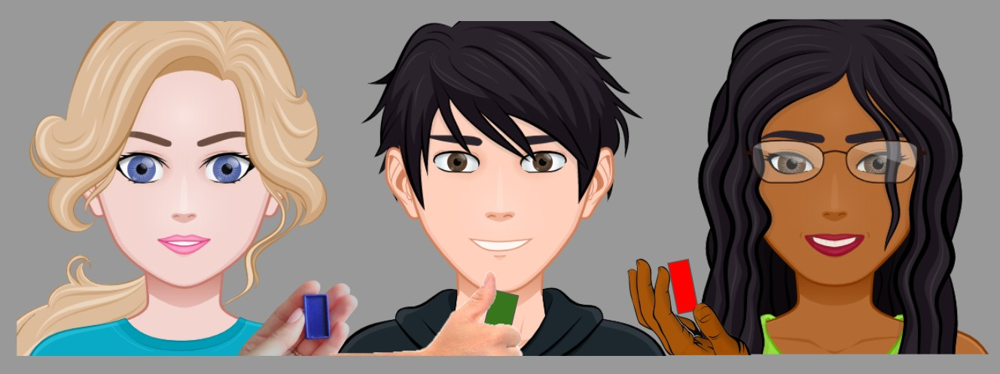
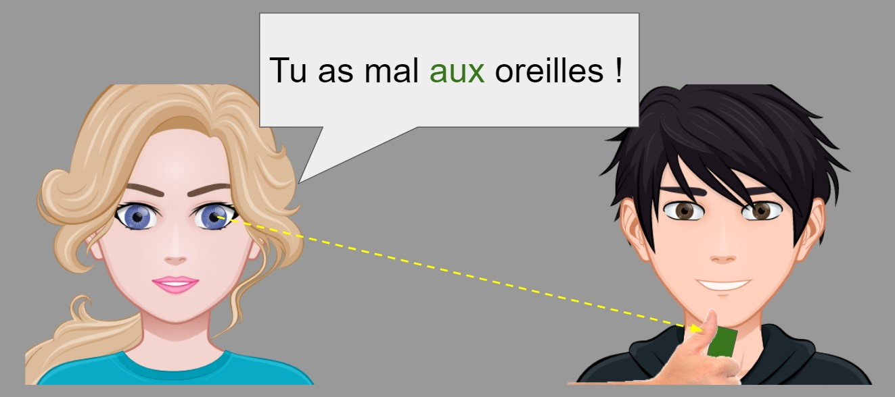
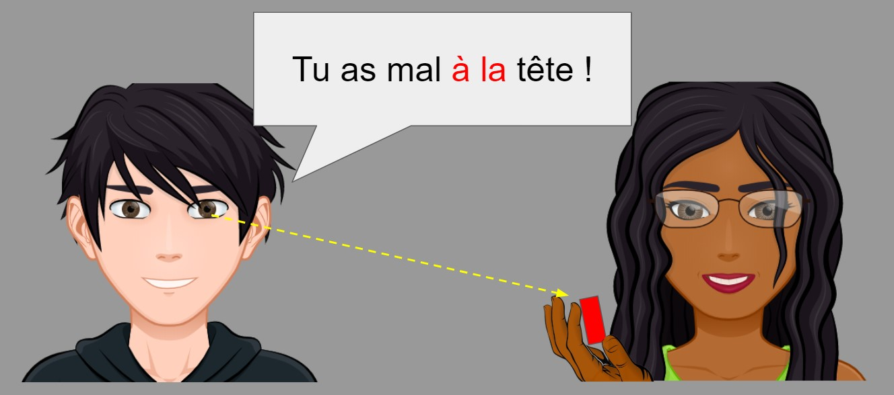
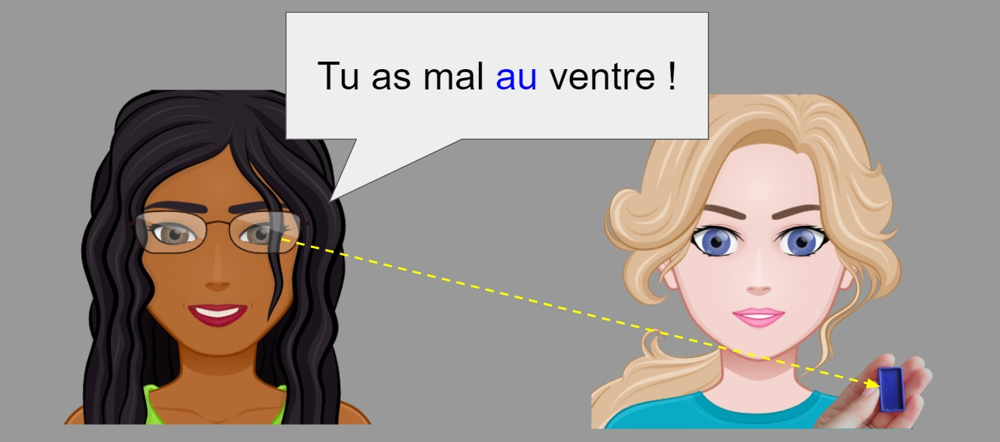

##### Comment rendre ludique et attrayant un simple exercice de grammaire ?

Afin de s'entraîner à utilser correctement les articles contractés précédés de la préposition "à", il ne suffit pas de bouger sa tête... Nous allons bouger tout notre corps !

Vous avez bien introduit/révisé [les noms des parties du corps](https://paysdufle.fr/vocabulaire/corps-et-sante/parties-du-corps/index.html), vous avez bien insisté sur [le genre](https://paysdufle.fr/grammaire/genre/les-parties-du-corps/index.html) de ces dernières, vous avez expliqué la règle concernant [les articles contractés avec la préposition "à"](https://paysdufle.fr/grammaire/articles-contractes/articles-contractes-avec-la-preposition-a/index.html). Il est temps de passer aux exercices de réinvestissement mais vous voyez que vos élèves ne sont plus concentrés sur la leçon: certains bâillent, d'autres ont l'air de somnoler sur leur cahier, Anne demande la permission d'aller aux toilettes... Tout le monde debout ! Il est temps de se réveiller en faisant de la grammaire !

##### Activité

**Objectif** : Utiliser correctement les articles contractés avec la préposition "à" ; 

**Niveau CECRL** : A1/A2.1 ; 

**Vocabulaire** : parties du corps, expression "avoir mal à..." ;

**Grammaire** : articles contractés, conjugaison du verbe "avoir";

**Compétences** : CO, PO ;

**Participants** : 2-30 personnes ;

**Matériel** : jetons/petits cartons de trois couleurs: bleu, rouge, vert, un petit sac ;

Exemple de jetons :

**photo A** Le bleu - pour indiquer le genre masculin ; 
**photo B** Le rouge - pour indiquer le genre féminin ;
**photo C** Le vert - pour indiquer le pluriel.

**Intelligences** : interpersonnelle, intrapersonnelle, visuo-spatiale, corporelle-kinesthésique, verbo-linguistique, naturaliste ;

##### Déroulement
1. Mettez les jetons dans un petit sac ;
2. Demandez à vos élèves de se mettre en cercle et de tirer au sort un jeton ;

Sur l'image, nous voyons Alice qui a tiré au sort un jeton bleu, Bob avec un jeton vert et Cécile avec un jeton rouge ;
3. Alice commence le jeu: elle regarde la couleur du jeton de son voisin. Puisque le jeton qu'il tient est vert, Alice comprend qu'elle doit utiliser un mot au pluriel ;
  
4. La phrase est grammaticalement correcte, Bob touche ses DEUX oreilles en confirmant : "Oui, j'ai mal aux oreilles" ;
5. Le professeur ou un autre élève, note au tableau le mot "oreilles" pour éviter les répétitions au cours du jeu ;  
6. C'est au tour de Bob de regarder la couleur du jeton de sa voisine. Puisque le jeton de Cécile est rouge, Bob comprend qu'il doit orienter son choix vers un mot féminin ;

7. La phrase est grammaticalement correcte, Cécile touche sa tête en confirmant : "Oui, j'ai mal à la tête" ;
8. Le professeur ou un autre élève, note au tableau le mot "tête" ;
9. Enfin, puisque Cécile est la dernière participante, elle regarde la couleur du jeton d'Alice. Ayant réalisé qu'elle doit utiliser un mot masculin, elle vérifie que son mot choisi ne figure pas au tableau après quoi elle prononce sa phrase ;

 
IMPORTANT :
- Si dans votre classe, il y a des personnes atteintes de troubles liés à la perception des couleurs, vous pouvez ajouter un petit astérisque (*) aux noms féminins et sur les jetons rouges. Pour accentuer le pluriel, vous pouvez adopter un symbole distinct de votre choix ;
- Dans un groupe très nombreux, on peut animer cette activité en binômes : une personne du binôme prononce la phrase, une autre va réagir à l'énoncé d'un binôme voisin ;
- En cas d'erreur, on va demander à l'apprenant de sortir du cercle des joueurs et de faire partie du jury qui, à la place du professeur peut décider si les phrases sont correctes, corriger les erreurs éventuelles de ses camarades et réintegrer le jeu en guise de récompense. C'est également à ce groupe d'apprenants que nous pouvons confier la tâche de noter au tableau les noms des parties du corps, comme décrit dans les points 5. et 8. (voir la description du déroulement de l'activité ci-dessus).