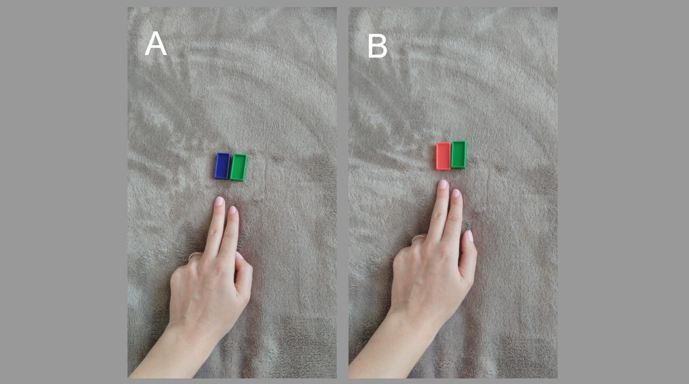
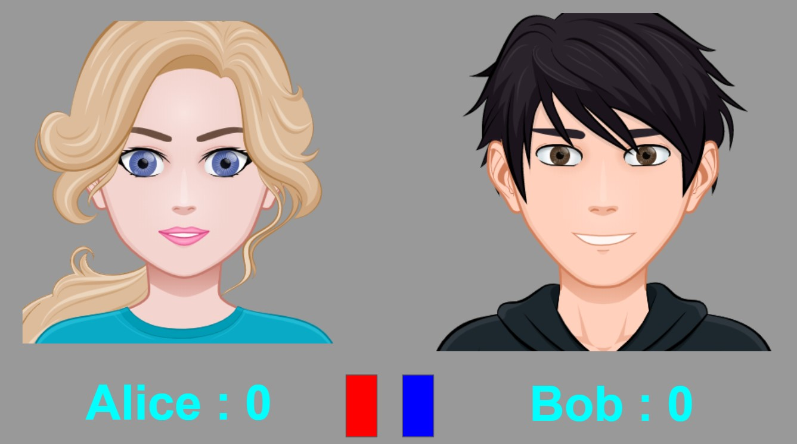
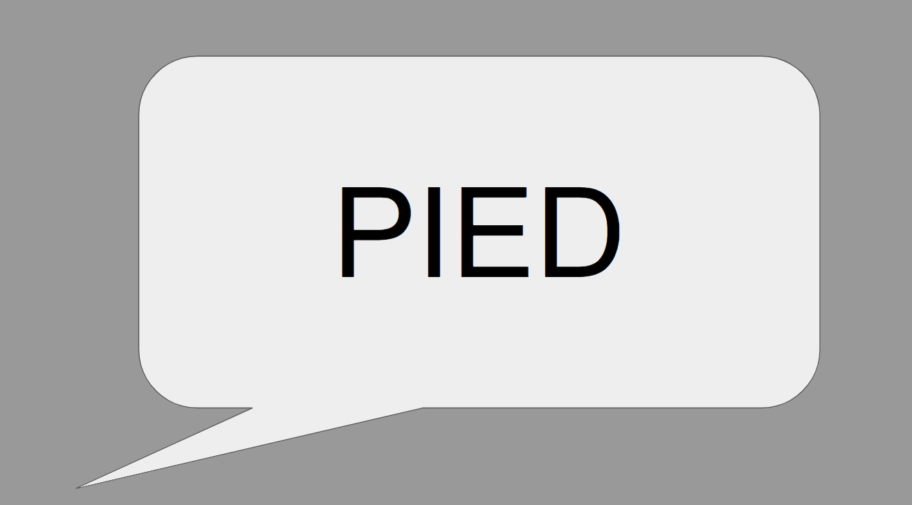
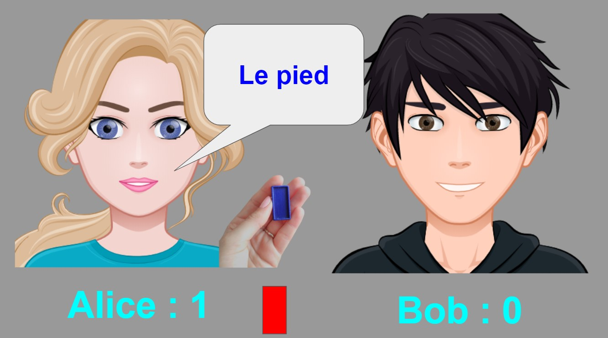

##### Comment rendre ludique et attrayant le travail sur la mémorisation du genre des parties du corps ?

Le genre des noms en français pose toujours un problème aux étudiants étrangers alors que pour les locuteurs natifs c'est une question du "feeling". "C'est injuste !" - vous allez me dire... Effectivement, il est difficile de voir la vie en rose dans cette situation... Néamoins, on pourrait essayer d'aborder cette question en nous aidant de trois couleurs : du bleu (pour illustrer le genre masculin), du rouge (le genre féminin) et du vert (la marque du pluriel). 

Cette propositions d'activité reste en rapport direct avec les exercices que vous pouvez trouver [ici](https://paysdufle.fr/grammaire/genre/les-parties-du-corps/index.html)

##### Activité

**Objectif** : Mémoriser le genre des parties du corps ; 

**Niveau CECRL** : A1 ; 

**Vocabulaire** : parties du corps ;

**Grammaire** : articles indéfinis/définis: masculins, féminins et pluriels ;

**Compétences** : CO, PO ;

**Participants** : 2-30 personnes ;

**Matériel** : jetons/petits cartons de trois couleurs: bleu, rouge, vert (on va se servir principalement de jetons bleus et rouges) ;

Exemple de jetons :

**photo A** Le bleu - pour indiquer le genre masculin ; 
**photo B** Le rouge - pour indiquer le genre féminin ;
**photo C** Le vert - pour indiquer le pluriel.

On peut également faire les "mix", en fonction de nos besoins :

**photo A** Le bleu et le vert - pour indiquer le genre masculin au pluriel ; 
**photo B** Le rouge et le vert - pour indiquer le genre féminin au pluriel.

**Intelligences** : interpersonnelle, visuo-spatiale, corporelle-kinesthésique, verbo-linguistique, naturaliste ;

##### Déroulement
1. Avant votre cours, vous pouvez écrire sur des bouts de papier, les noms de toutes les parties du corps (sans déterminants !!!) que vous avez étudiées en classe. Ces fiches vont constituer votre pioche ;
2. Divisez votre classe en 2 groupes ;
3. Placez au milieu, une petite table ou une chaise sur laquelle vous allez disposer deux jetons : un bleu et un rouge ;  
4. Un représentant de chaque équipe s'approche de la table avec les jetons ; 

Sur l'image, Alice représente l'équipe "A" alors que Bob est le délégué de l'équipe "B" ;
5. Le professeur pioche une carte avec le nom d'une partie du corps et il le lit à voix haute ;

6. Les représentants essaient de prendre le plus rapidement possible le jeton avec la couleur correspondant au genre de la partie du corps mentionnée et celui qui est plus rapide ajoute le déterminant correct ;

Alice était plus rapide, elle a choisi le bon déterminant par conséquent, elle a gagné un point pour l'équipe "A" ;
7. Bob n'a pas gagné de point mais il ne repart pas sans rien car c'est lui qui va piocher une autre carte et lire le nom de la partie du corps notée dessus pour les délégués suivants, à la place de l'enseignant ;
8. Deux autres représentants des équipes "A" et "B" viennent à la table et l'activité se déroule comme décrit ci-dessus jusqu'à ce qu'il n'y ait plus de cartes dans la pioche.
 
IMPORTANT :
- Si dans votre classe, il y a des personnes atteintes de troubles liés à la perception des couleurs, vous pouvez ajouter un petit astérisque (*) aux noms féminins et sur les jetons rouges. Pour accentuer le pluriel, vous pouvez adopter un symbole distinct de votre choix.