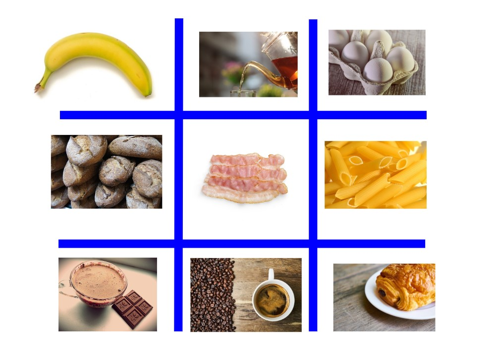
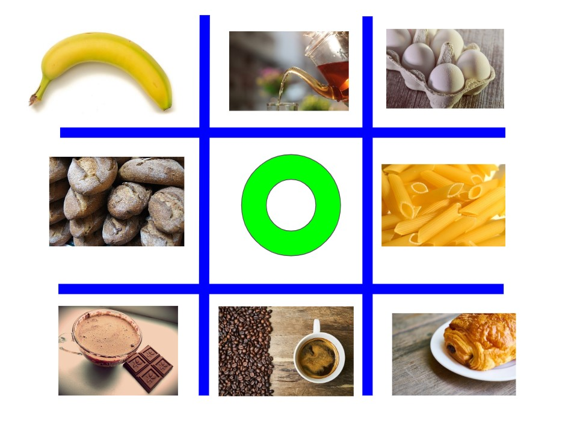
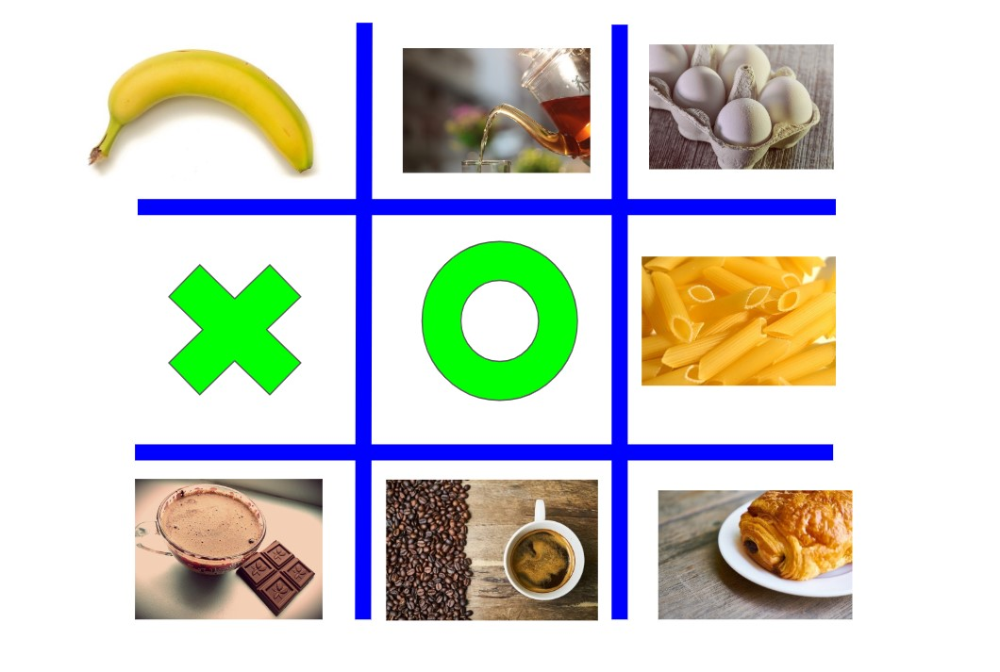
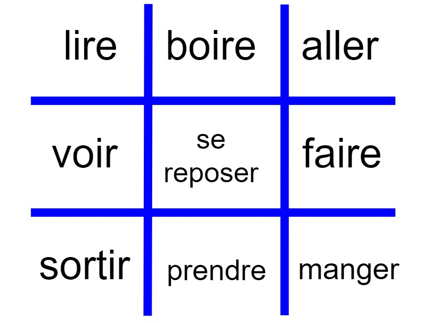
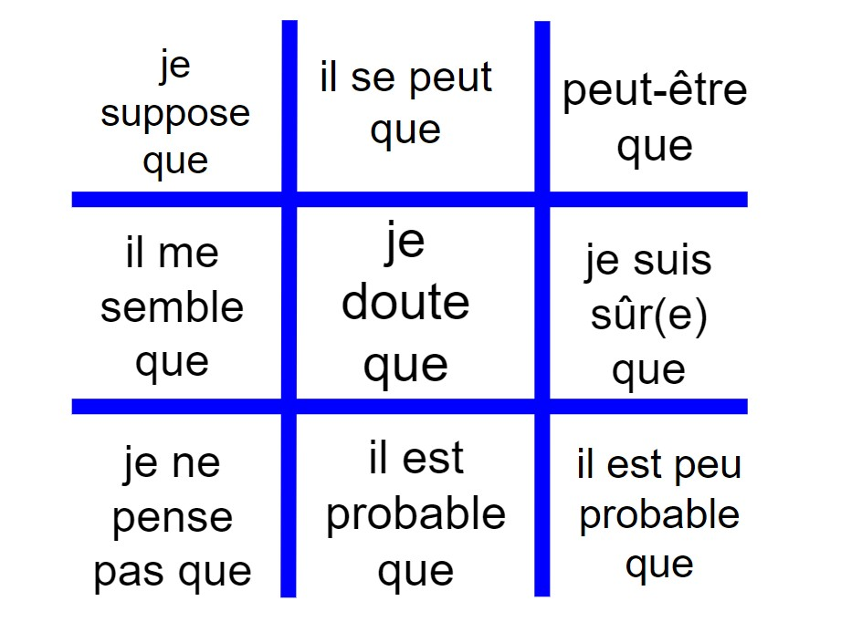

##### Jouer en classe de FLE ne nécessite pas beaucoup de préparation

Un seul jeu qui peut être adapté à toute sorte de thématique ... 

Et si j’ajoute qu’il est gratuit, que nous pouvons l’animer dans une salle avec deux ou trente élèves, sans accès à Internet et pendant une coupure générale d’électricité ? Ce n'est pas un rêve, ce jeu existe et vous le connaissez bien depuis votre enfance... Le jeu du morpion !

La règle du jeu est vraiment très simple, il s'agit tout d'abord de dessiner une grille de trois cases sur trois. Ensuite, les joueurs mettent tour à tour un symbole : un cercle ou une croix, dans les cases vides, afin d'aligner les trois symboles identiques horizontalement, verticalement ou en diagonale. Regardez l'exemple ci-dessous.

    <iframe class="embed-responsive-item" src="https://docs.google.com/presentation/d/e/2PACX-1vQvEgpJrVQ9WGz3k3Y3S8FSLuZ2p1quLvYiVuMJp8SlyZU6_qL08RG4rmeNZNgn2Q2kqY3htL-TEj9c/embed?start=true&loop=true&delayms=3000" frameborder="0" allowfullscreen="true" mozallowfullscreen="true" webkitallowfullscreen="true"></iframe>

##### Activité FLE

**Objectif** : parler de ses habitudes alimentaires ; 

**Niveau CECRL** : A1/A2 ; 

**Vocabulaire** : noms d'aliments ;

**Grammaire** : articles indéfinis, partitifs, négation ;

**Compétences** : CO, PO, PE ;

**Participants** : 2-30 personnes ;

**Matériel** : tableau, feutres, images d'aliments, patafixe/aimants pour tableau/ruban adhésif ;

**Intelligences** : interpersonnelle, intrapersonnelle, logico-mathématique, visuo-spatiale, corporelle-kinesthésique, verbo-linguistique ;

##### Déroulement
1. Tracez la grille au tableau ;
2. Placez les images d'aliments à l'intérieur de chaque case libre (voir la photo ci-dessous);
   
3. Divisez votre classe en deux équipes: une équipe de "cercles" et une équipe de "croix" ;
4. Ecrivez au tableau la question suivante : "Que prenez-vous au petit-déjeuner ?" ;  
5. "L'équipe de cercles" se met d'accord sur une case de la grille. Imaginons qu'elle vise la case de milieu où figure la photo du bacon ;
6. Bob qui est le premier représentant de "l'équipe de cercles", ne mange pas de bacon au petit-déjeuner. Il formule donc la phrase suivante : "Je ne mange pas de bacon au petit-déjeuner." ;
7. Puisque la phrase est correcte, l'enseignant ou un autre élève, enlève la photo du bacon du tableau et dessine un cercle dans la case vide (voir la photo ci-dessous);

8. C'est au tour de l'autre groupe; les membres de "l'équipe de croix" suggèrent à Alice qui est leur réprésentante, de viser la photo avec du pain. Alice qui prend des sandwichs tous les matins, annonce à la classe : "Au petit-déjeuner, je mange du pain." ;  
9. La phrase est également correcte, l'enseignant ou un autre élève, enlève donc la photo du pain du tableau et, à sa place, il marque le symbole de de la croix (voir la photo ci-dessous);

10. Face à ce choix de "l'équipe de croix", "l'équipe de cercles" décide d'essayer d'aligner leurs symboles en diagonale mais ce n'est plus Bob qui va prendre la parole mais une autre représentante/un autre représentant de ce groupe...
11. Le jeu s'arrête au moment où l'un des groupes arrive à placer ses symboles dans le même rang à l'horizontale, à la verticale ou en diagonale ou bien, quand il n'est plus possible de gagner la manche. Dans ce dernier cas, si le temps le permet, on peut décider de rejouer.

IMPORTANT :
- Si le membre d'une équipe fait une erreur relativement grave dans sa phrase, l'enseignant peut décider de céder le tour à l'équipe adverse ;
- Cette activité peut déboucher sur une production écrite où nous allons demander à tous les élèves de décrire les habitudes alimentaires de leurs camarades, en se basant sur les informations que ces derniers ont données au cours du jeu.

##### Variantes
On peut jouer au jeu du morpion à des niveaux plus avancés pour des énoncés plus complexes.
1. Au niveau A2, nous pouvons exploiter la grille ci-dessous et demander à nos élèves de raconter leurs activités du weekend passé, en utilisant le passé composé. La même grille peut nous servir un peu plus tard, à  poser la question sur les projets pour les vacances, à l'occasion de travailler sur le futur simple.  

2. Au niveau B1+, nous pouvons animer de vrais débats autour de différents sujets d'actualité et vérifier par la même occasion, si nos élèves savent après quelles expressions, il est nécessaire de mettre le subjonctif...

Bon courage ! Amusez-vous bien !